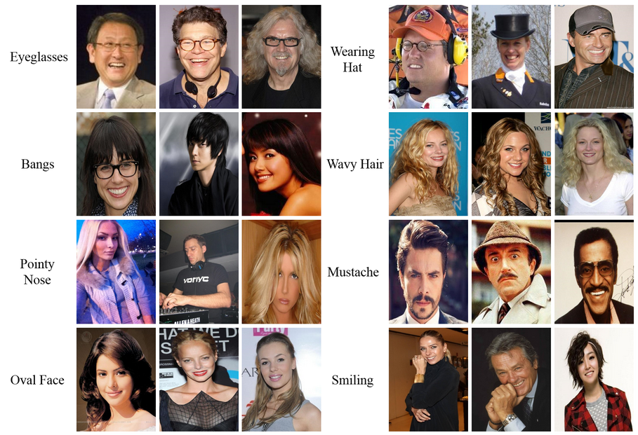
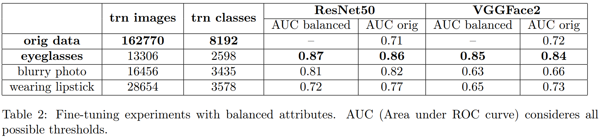
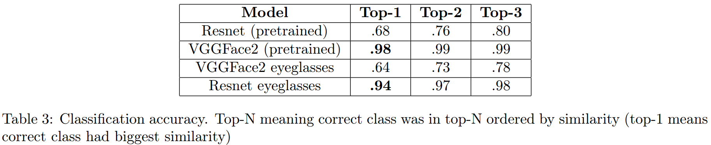
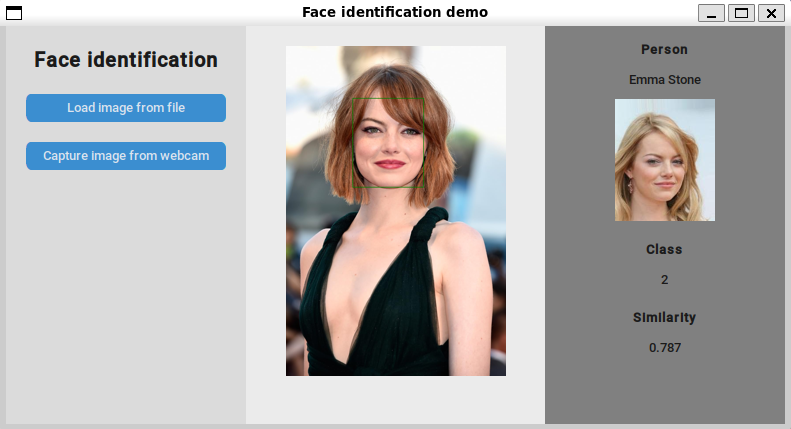

# POVa_face_identification
POVa project (Computer Vision) at FIT (B|V)UT. 2024/2025 winter semestr.
(POVa is a shortcut of the course in czech: Počítačové vidění = Computer vision)

   
  Face identification pipeline.

## Assignement

 
Prepare a demo application demonstrating facial recognition in good lighting conditions. Evaluate accuracy on you own data and on a existing datset.

 Ideal approach is:
- Detect faces using existing detector. Good choices are OpenCV, Dlib or MTCNN https://github.com/DCGM/mtcnn.
- Align the face based detected facial features (map to avarage face).
- Extract face fingerprint using a convolutional neural network. You can start with some pretrained network or train or fine-tune your own - search Model Zoo for suitable network https://github.com/BVLC/caffe/wiki/Model-Zoo.
- Search database of faces.

Sources:
- https://github.com/betars/Face-Resources
- OpenFace https://cmusatyalab.github.io/openface/
- https://www.pyimagesearch.com/2017/04/03/facial-landmarks-dlib-opencv-python/
- https://kpzhang93.github.io/MTCNN_face_detection_alignment/
- http://www.openu.ac.il/home/hassner/projects/augmented_faces/
- http://www.robots.ox.ac.uk/~vgg/software/vgg_face/

## Results [Report](/docs/final_report.pdf) [Presentation](/docs/final_presentation.pdf)

The goal of this project was to develop a facial recognition system from images. To achieve this, we implemented and evaluated a system utilizing two pre-trained models (VGGFace2 and ResNet50) alongside
fine-tuning techniques. Our experiments demonstrated the effectiveness of attribute-focused training in improving recognition accuracy under challenging conditions such as sunglasses, lipstick, and blurry images. The
results confirmed the robustness of the selected models and methodologies while highlighting areas for further
optimization. The resulting demo application provides a practical example of face identification, showcasing
its potential for user-friendly face recognition.

   
  Sample images from CelebA dataset we choosed for fine-tuning experiments.

   
  Fine-tuning results for specialized tasks.

   
  Classification accuracy of trained vs untrained models.

   
  Screenshot of our demo application.

